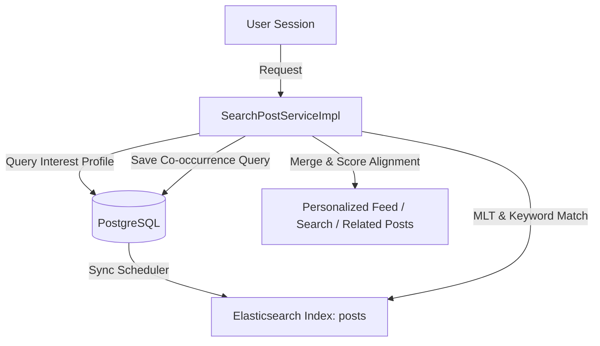

# Elasticsearch Search & Recommendation System Design - Forum Module

This design document describes the architecture, database mappings, search algorithms, and scoring strategies implemented to provide a high-performance, personalized search and content recommendation system for the Forum Module.

---

## 1. System Architecture

The recommendation engine adopts a hybrid SQL + NoSQL search architecture:

- **Read Model Source of Truth**: Postgres Database stores posts, comments, user saves, and activity logs.
- **Search & Index Indexer**: A scheduled synchronization runner updates the Elasticsearch (`posts`) index.
- **Relevance & Scoring Engine**: Elasticsearch computes textual relevance (`BM25`), category popularity, time decay, and interest matching (`More Like This`).
- **Graph & Co-occurrence Modifiers**: Live relational calculations (like save co-occurrences) are queried from SQL and merged in memory with the Elasticsearch retrieval set.



---

## 2. Elasticsearch Document Schema

The `PostDocument` is mapped as a self-contained representation of a post version, eliminating the need to query the database during search retrievals.

| Field              | Type      | Description / Analyzer                                             |
| ------------------ | --------- | ------------------------------------------------------------------ |
| `id`               | `keyword` | Unique identifier (Post UUID)                                      |
| `title`            | `text`    | Standard analyzer                                                  |
| `shortDescription` | `text`    | Standard analyzer                                                  |
| `content`          | `text`    | Standard analyzer                                                  |
| `authorUsername`   | `keyword` | Creator username                                                   |
| `authorFullName`   | `text`    | Standard analyzer                                                  |
| `authorAvatarUrl`  | `keyword` | Profile picture URL                                                |
| `thumbUrl`         | `keyword` | Post thumbnail public URL                                          |
| `createdAt`        | `date`    | Creation time (Java Instant, serialized to epoch milliseconds)     |
| `updatedAt`        | `date`    | Last updated time (Java Instant, serialized to epoch milliseconds) |
| `viewCount`        | `long`    | Total view events from activity logs                               |
| `commentCount`     | `long`    | Live comments count                                                |
| `saveCount`        | `long`    | Total saves count                                                  |
| `popularityScore`  | `double`  | Cached pre-computed popularity value                               |
| `combinedText`     | `text`    | Concat fields for full-text search optimization                    |

---

## 3. Data Synchronization

To ensure near real-time statistics and new posts appear in searches without mutating core application code:

1. **Startup Synchronization**: An `@EventListener(ApplicationReadyEvent.class)` triggers on application startup, creating/remapping the index and executing a bulk indexing process.
2. **Periodic Synchronization**: A `@Scheduled` task executes every 60 seconds to synchronize content, view logs, comment updates, and saves.

---

## 4. Query & Scoring Specifications

### 4.1 Personalized & Popularity Feeds (`getPostsInFeed`)

#### Anonymous Feed

Calculates relevance based on popularity and freshness. Freshness decay uses a daily decay rate:
$$popularityScore = \ln(viewCount + 1) + commentCount \times 2 + saveCount \times 3$$
$$diffDays = \frac{now - createdAt}{86400000}$$
$$freshnessScore = \frac{1}{1 + diffDays}$$
$$feed\_score = popularityScore \times 0.6 + freshnessScore \times 0.4$$

#### Logged-in Feed (Personalized)

1. **User Interest Profile**: Queries user interactions:
   - Posts saved by user.
   - Posts commented on by user.
   - Posts viewed by user (logged as `post.view` in tracking logs).
2. **Relevance Query**: Executes a `More Like This` (MLT) query on `title`, `shortDescription`, and `content` using the user's interacted post IDs.
3. **Exclusion Filters**: Filter out posts already in the user's interaction profile to maximize content discovery.
4. **Scoring Scheme**: Incorporates interest match score ($interestScore$), popularity, and time decay:
   $$feed\_score = interestScore \times 0.5 + popularityScore \times 0.3 + freshnessScore \times 0.2$$

---

### 4.2 Search Engine (`searchPosts`)

#### Anonymous Search

- Executes a `multi_match` query boosting key attributes: `title^3`, `shortDescription^2`, and `content^1`.

#### Logged-in Search (Personalized Search)

- Wraps the `multi_match` keyword search inside a `bool` query.
- Places the keyword query as a `must` condition (determines eligibility).
- Places the `More Like This` query based on user's interest profile as a `should` condition (adds an interest boost).
- Ensures two users searching for the same keyword receive search rankings customized to their personal preferences.

---

### 4.3 Related Posts Engine (`getRelatedPosts`)

Combines text similarity, popularity, and collaborative filtering:

1. **Save Co-occurrence (SQL Native)**:
   Calculates how frequently other posts are co-saved with the current post by the same userbase:
   ```sql
   SELECT s2.post_id, COUNT(*) AS co_occurrence_count
   FROM saved_post s1
   JOIN saved_post s2 ON s1.username = s2.username
   WHERE s1.post_id = :postId AND s2.post_id <> :postId
   GROUP BY s2.post_id
   ORDER BY co_occurrence_count DESC LIMIT 50
   ```
2. **Text Similarity & Popularity (ES)**:
   Retrieves similar documents using `More Like This` (MLT) combined with popularity:
   $$esScore = similarityScore \times (1.0 + popularityScore \times 0.1)$$
3. **Hybrid Scoring Merge (Java)**:
   Aligns indices and merges the results in memory:
   $$finalScore = esScore + coOccurrenceCount \times 2.0$$
   The final list is sorted descending and capped at the top 10 results.

---

## 5. Advanced Design Strategies & Technical Evaluation

### 5.1 Cold Start Strategy

For a newly registered user or a user who has not interacted with any content (no saves, no comments), their interest profile is empty. To resolve this:

- **Fallback Activation**: The system detects if the interest profile (`interactedPostIds`) is empty.
- **Anonymous Feed Fallback**: When no interest signals exist, the Elasticsearch query matching shifts from personalized MLT to the **Anonymous Feed Ranking** algorithm, sorting all active posts solely based on `Popularity Score` (views, comments, saves) and `Freshness Score` (date decay). This guarantees that new users are always presented with trending, active content instead of an empty feed.
- **Hybrid Elastic Search Retrieval**: For active users, the personalized feed runs a hybrid `bool` query. It matches all active posts (`must match_all`) but adds the `More Like This` interest profile as a `should` boost. If Elasticsearch fails to match any content with the user's MLT interests, the interest score falls back to 0.0, and posts are smoothly ranked by their baseline popularity + freshness scores.

### 5.2 Cursor Pagination Analysis

- **Current Paging Mechanism**: The project utilizes opaque Base64 cursors that encode offset-based parameters. This is suitable for standard database pagination but carries risks when ranking by dynamic scores.
- **Evaluation & Risks**:
  - _Duplicate/Missing Posts (Drift)_: Since the recommendation feed scores are computed dynamically (freshness decays relative to the current time, views/comments count changes), the scoring of posts shifts in real-time. If a user moves to Page 2 while scores are shifting or new posts are added, some posts might slide between pages, causing duplication or missed content.
- **Elasticsearch Mitigation (Search After)**:
  - _Recommendation_: The design proposes moving to Elasticsearch `search_after` pagination.
  - _Format_: The cursor should encode a compound key: `[score, post_id]`.
  - _Benefits_: Using the combination of the exact score and the unique document ID as a tie-breaker prevents cursor drift, since Elasticsearch can retrieve the next page relative to the specific sorting values of the last record on the previous page.

### 5.3 Caching Strategy

- **Layer Selection**: Tapping into the pre-existing project `RedisUtils` cache wrapper. No new caching dependencies are introduced.
- **Caching Mechanism**:
  - **Key**: `user_interactions:{username}`
  - **Values**: List of top 100 post IDs (`List<UUID>`) that the user has interacted with (saved or commented on).
  - **TTL**: 2 hours.
- **Eviction / Invalidation**: The cache is updated/invalidated when a user performs a save action, deletes a save, or creates a new comment, ensuring the personalization profile updates dynamically when active feedback is registered.

### 5.4 Interaction Signals & Future Roadmap

The engine currently distinguishes between active historical signals and reserves placeholder features for future integration.

#### Current Version Signals

- **Saved Posts (Weight = 5.0)**: Represents the strongest expression of interest.
- **Comment History (Weight = 3.0)**: Represents active engagement.
- **Recency Decay Multiplier**: Signals are decayed based on the interaction time:
  - Interaction $\le 30$ days ago: $1.0\times$ multiplier.
  - Interaction $\le 90$ days ago: $0.5\times$ multiplier.
  - Interaction $> 90$ days ago: $0.1\times$ multiplier.

#### Future Signals & Known Limitations (Future Roadmap)

- **View History (Weight = 0.0, Temporarily Disabled)**: Reading track logs directly in real-time places heavy loads on relational databases. Real-time view history tracking will be offloaded to Kafka / Clickhouse and integrated in subsequent versions.
- **Search History (Weight = 0.0, Temporarily Disabled)**: Query text embedding vectors and history logs will be indexed in a user search profile.
- **Like/Reactions (Weight = 0.0, Temporarily Disabled)**: Upvotes/downvotes are not present in the current forum schema and will be supported upon schema updates.

### 5.5 Feed Consistency Analysis
- **Feed Starvation Risk**: Relying entirely on personalization means users with narrow interest profiles (e.g., only "React Hooks") will run out of content to consume once all matching posts are read, leading to an empty or stagnant feed.
- **Filter Bubble Risk (Feed Isolation)**: Pure interest matching traps users in an informational bubble, preventing them from discovering top trending topics, site-wide announcements, or articles from other sub-forums.
- **Diversity Strategy (Exploration vs. Exploitation)**: To balance exploration (discovering new subjects) and exploitation (recommending known interests), the engine aims for an 80/20 balance:
  - **Exploitation (80%)**: Surfacing content highly relevant to historical interactions.
  - **Exploration (20%)**: Infusing globally popular and fresh posts into the user's feed.
- **Final Chosen Approach**: 
  Instead of hard-coded split-bucket pagination, this balance is built mathematically into the Elasticsearch script scoring formula:
  $$finalScore = interestScore \times 0.5 + popularityScore \times 0.3 + freshnessScore \times 0.2$$
  By restricting the personalization weight to $X = 0.5$ and allocating $50\%$ to global scores ($Y = 0.3$ popularity, $Z = 0.2$ freshness), globally viral or highly fresh posts naturally break through the interest filter and appear in the personalized feed.

### 5.6 Related Posts Fallback Strategy
To guarantee that the related posts section never returns an empty list, the service coordinates a multi-tier fallback, merge, and deduplication pipeline:
1. **Similarity Search**: Performs a `More Like This` (MLT) query on Elasticsearch to retrieve textually similar posts.
2. **Co-occurrence Search**: Executes a native SQL query on the relational database to find other posts co-saved by users who saved the current post.
3. **Global Recommendation Fallback**: If the combined candidate set contains fewer than 5 unique posts (occurring when the post is very short, brand new, or highly specific), the engine retrieves up to 50 global trending posts based on:
   $$globalScore = popularityScore \times 0.7 + freshnessScore \times 0.3$$
4. **Merge Logic**: The similarity results are assigned their hybrid score, and DB co-occurrence weights are merged. If the unique candidate count is under 5, global recommendations are appended to backfill the list.
5. **Deduplication Logic**:
   - **Current Post Exclusion**: The current post (`postId`) is explicitly excluded.
   - **Candidate Deduplication**: A tracking map guarantees no post is duplicate-merged.
   The merged list is sorted by the final score descending, and the top 10 responses are returned.

### 5.7 Total Elements Consistency
- **Core Principle (Re-ranking vs Filtering)**: Personalization algorithms are designed exclusively to **Re-rank** content rather than **Filter** it. The total number of available elements in the system (`totalElements`) must be strictly identical between an Anonymous User and a Logged-in User. The candidate pool size should only be reduced by global business logic rules (e.g., deleted posts, unapproved status), not by personalization.
- **Why totalElements Must Not Change**:
  If a personalized feed filters out read posts or unmatched subjects (e.g., using `must_not` or restrictive `must` queries), the user experiences a diminishing content pool. Once they interact with the majority of their preferred topics, their `totalElements` will shrink dramatically, giving a false impression that the forum is inactive or lacking content.
- **Implementation Strategy**:
  - Previously, the system used a `must_not` clause to explicitly exclude a user's interacted posts from their feed. This caused their `totalElements` count to decrease relative to the Anonymous view.
  - To fix this and preserve consistency, the `must_not` exclusion was entirely removed.
  - Instead of filtering, already-read posts are mathematically heavily penalized during the Elasticsearch scoring phase (via the Painless `script_score`). The script dynamically checks if the `doc['id'].value` is present in the `params.interactedIds` array and applies a `0.0001` multiplier penalty.
  - **Result**: Anonymous and Logged-in users query the exact same candidate dataset with identical counts. Logged-in users just view the data cleanly sorted according to their interests, with their previously read posts dropped to the far end of the pagination cursors.

